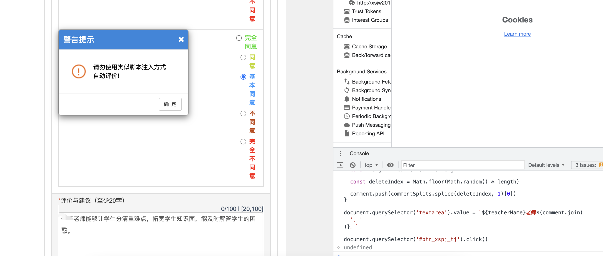
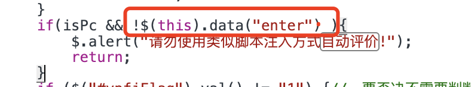

# 华南某工教务处教师评价一键脚本

## Usage

评价页面按<kbd>f12</kbd>进入控制台，复制代码回车即可。

## Your own comment

评价选项默认权重为

| 完全同意 | 同意 | 基本同意 | 不同意| 完全不同意|
|:----:|:----:|:----:|:----:|:----:|
| 3 | 3 | 1 | 0 | 0 |

可修改 `choiceWeight` 调整权重

评价文本根据 `commentSplits` 随机选取三句进行拼接，欢迎PR补充。

## 2022.6.24更新

直接用之前的脚本会弹出脚本注入的警告



翻了下源码，是这么一回事




所以按其方式给这个`enter`赋值即可(注意`this`的指向)

```js
$('#btn_xspj_tj').data('enter', true)
```
